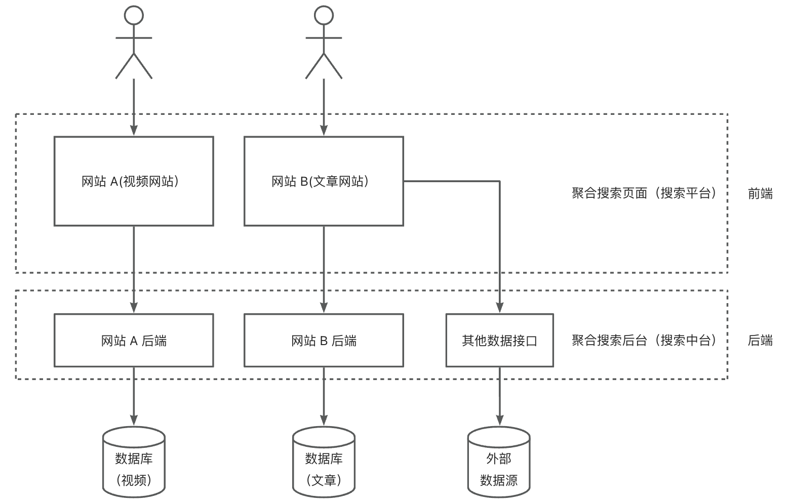

# FusionFinder聚合搜索平台后端

基于 Java SpringBoot 的项目初始模板，整合了常用框架和主流业务的示例代码。

### 技术栈

- Spring Boot 2.7.x + springvoot-init 脚手架
- MySQL 数据库（8.x版本）
- Elastic Stack
  - Elasticsearch 搜索引擎
  - Logstash 数据管道
  - Kibana 数据可视化
- 数据抓取（jsoup、HttpClient爬虫）
  - 离线
  - 实时
- 设计模式
  - 门面模式
  - 注册器模式
  - 适配器模式
- 数据同步（4种同步方式）
  - 定时
  - 双写
  - Logstash
  - Canal
- JMeter压力测试

## 项目简介
基于Vue3 + SpringBoot +Elastic Stack 的一站式聚合搜索平台。

对用户来说，使用该平台，可以在同一个页面集中搜索出不同来源、不同类型的内容，提升用户的检索效率和搜索体验。

对企业来说，当企业内部又多个项目数据都存在搜索需求时，无需针对每个项目单独开发搜索功能，可以直接将各项目的数据源接入搜索中台，从而提升开发效率、降低系统维护成本。

## 项目架构图：

